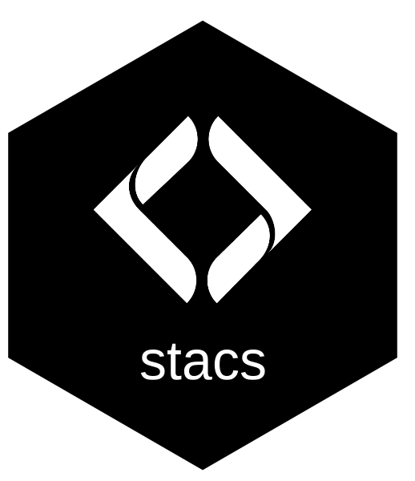

# stacs 

**Documentation:** <https://newgraphenvironment.github.io/stacs/>

<!-- --8<-- [start:home] -->
Register a STAC catalogue into [pgstac](https://github.com/stac-utils/pgstac) and prove it
arrived.

**`stacs` works on a catalogue after its items exist.** It does not read source data or
build items: that belongs to the repository that owns the source. Anything source-agnostic
that is done to a published catalogue belongs here.

> **Status: pre-release.** Extracted from
> [`stac_dem_bc`](https://github.com/NewGraphEnvironment/stac_dem_bc), where the
> registration and verification code has run against a 102,460-item collection.

## What it does

- **Verify** what a STAC API serves against what is published: item id sets compared in
  both directions, and every item body compared by digest. Never by count: a STAC API
  omits ids it does not have without reporting an error, so equal counts can hide unequal
  sets. A body that could not be read is an error, never "unchanged".
- **Register** with upserts only, collection before items. Nothing deletes. `drift`
  registers only what the API is missing or serves differently, which keeps it stateless:
  a skipped run is picked up by the next one. Every write is followed by a check that the
  API now serves the body that was sent.
- **Audit** items before they are registered: each names the collection it is going into,
  and carries the asset keys the catalogue declares (`require`) and none it has retired
  (`forbid`).
- **Validate** items with [`pystac`](https://github.com/stac-utils/pystac).

Body digests are SHA-256 over [RFC 8785](https://www.rfc-editor.org/rfc/rfc8785) (JCS)
canonical JSON, with `links` removed (the API rewrites them) and null members dropped
(pgstac strips them). [`research/pgstac_round_trip.md`](https://github.com/NewGraphEnvironment/stacs/blob/main/research/pgstac_round_trip.md)
records what pgstac changes between load and serve, and why each rule exists.

## Install

Managed with [uv](https://docs.astral.sh/uv/). Install from git rather than PyPI: the
`stacs` name on PyPI belongs to an unrelated, archived project.

```toml
[tool.uv.sources]
stacs = { git = "https://github.com/NewGraphEnvironment/stacs", tag = "v0.1.0" }
```

Without uv: `pip install "stacs @ git+https://github.com/NewGraphEnvironment/stacs@v0.1.0"`.

<!-- --8<-- [end:home] -->

## Configure

<!-- --8<-- [start:configure] -->
The host, database, API and bucket are always the caller's. `stacs` has no defaults that
point at any deployment, and reads a config only when one is named with `--config`.

```toml
# stacs.toml -- committed in the catalogue's own repository. Values are examples.
[catalogue]
api = "https://stac.example.org"            # STAC API base URL
collection_id = "my-collection"
bucket_url = "https://my-bucket.example.org" # serves collection.json and the items

[assets]
require = "data"        # every item must carry this asset key
forbid = ["legacy"]     # no item may carry any of these

[transport]             # only for commands that write
host = "user@stac-host.example.org"
db = "pgstac"
env_file = "/srv/stac/.env"           # sourced on the host before loading
workdir = "/srv/stac"                 # cd here on the host
path_prepend = "/usr/local/bin"
pg_host = "localhost"
pg_port = 5432
pg_user = "pgstac"
password_env = "POSTGRES_PASSWORD"    # the NAME of a variable the env_file defines
pypgstac = ["uv", "run", "pypgstac"]  # the launcher on the host

[tuning]                # optional
page_size = 10000       # keyset page size for full enumerations
chunk = 500             # ids per lookup when checking what was just written
fetch_workers = 20
```

Flags override the catalogue and transport settings. The asset rules can be added to by a
flag but never loosened: a declared `require` cannot be replaced, and `--forbid-asset`
adds keys. Pointing at another collection id does not drop them.

**No setting is a secret.** Writes go over ssh to the STAC host, which runs
`pypgstac load --method upsert` there; the database password stays on the host and is
named (`password_env`), never given. The config refuses unknown keys, so a `password`
line is an error rather than a silently ignored secret.

<!-- --8<-- [end:configure] -->

## Use

<!-- --8<-- [start:use] -->
```bash
stacs verify   --config stacs.toml --out-dir verify_report/   # changes nothing
stacs register --config stacs.toml --mode drift               # what the API lacks or serves stale
stacs register --config stacs.toml --mode all --dryrun
stacs register --config stacs.toml --mode ids --ids-file ids.txt
stacs audit    --config stacs.toml --dir build/items/ --expect 120
stacs validate --dir build/items/

# Repositories that register their own build output directly -- collection first:
stacs load collection --config stacs.toml build/items/collection.json
find build/items -name '*.json' ! -name collection.json \
  | stacs load items --config stacs.toml
```

`load` checks every item against the declared collection and asset rules before sending,
and refuses an id that appears twice; it exits 1 if there was nothing to load.

`verify` exits 1 on any drift and writes `missing.txt`, `changed.txt`, `orphaned.txt` and
`collection_state.txt` to `--out-dir`. `register` refuses before writing wherever it can:
a collection id that does not match the published `collection.json`, an item link
duplicated or pointing at a body that names another id, a body that could not be fetched,
an item that fails the audit, an unreachable host.

`ids` mode checks only the ids it registered. If `collection.json` changed, run `verify`
after it: pgstac serves items hydrated against their collection, so a collection change can
change how untouched items read back. `all`, and a `drift` whose collection changed,
re-compare the whole catalogue after writing for that reason.

### What it assumes

- The STAC API is [stac-fastapi](https://github.com/stac-utils/stac-fastapi) on pgstac, or
  speaks its paging dialect: POST `/search` with `collections`, `ids`, `limit` and
  `fields`, the continuation token in the `next` link's **body**.
- Items are linked from `collection.json` with `rel: item`, and an item's id is its file
  name without `.json`, with `%20` read as a space. Child catalogues are refused, not
  skipped.
- The STAC host has bash and a `pypgstac` that can reach the database.

<!-- --8<-- [end:use] -->

## Development

<!-- --8<-- [start:development] -->
```bash
uv sync
uv run pytest
```

The tests run offline: a stub STAC API on loopback, a stub `ssh` that runs the remote
script locally against a fake `pypgstac`, and a guard that refuses any DNS lookup outside
loopback.

<!-- --8<-- [end:development] -->

## License

MIT
